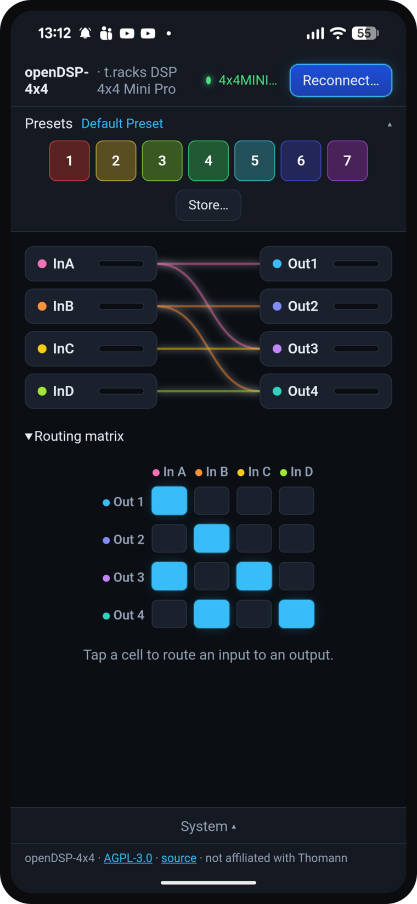

# openDSP-4x4 — portable control for the t.racks DSP 4x4 Mini Pro

  
  
  
  
  

Open-source, cross-platform control software for the **the t.racks DSP 4x4 Mini Pro**
(a 4-in/4-out XLR DSP that ships with Windows-only editor software).

  

**[▶ Open the web app](https://glassontin.github.io/opendsp-4x4/)** — desktop Chrome/Edge over
WebHID; nothing to install. &nbsp;·&nbsp; **[⬇ Android APK](https://github.com/GlassOnTin/opendsp-4x4/releases/latest)** —
phone/tablet over USB-OTG. &nbsp;Plug the DSP in and tap *Connect*.

Goals:
- **Portable GUI** on desktop (Linux/Windows/macOS) and **Android over USB-OTG** — control
  the DSP from a phone/tablet at a gig.
- Eventual **full editor parity**: PEQ, crossovers, delays, limiters, gain/mute, routing,
  presets.
- Clean, strongly-typed, well-separated codebase; everything driven by one documented
  protocol.

## Status — desktop (WebHID) and Android (USB-OTG) apps both working and verified on hardware.

The device is a USB-HID device (`0168:0821`) using 64-byte interrupt reports. The control
protocol was developed **clean-room**, by observing the device's USB-HID traffic and probing
it directly (write a known value, read it back, match the bytes); see [`PROTOCOL.md`](PROTOCOL.md).
The protocol is the single source of truth and is implemented per-platform:

- **`web/`** — TypeScript + **WebHID** desktop app (Chrome/Edge). Zero-install. Routing,
  gain/mute/polarity, 7-band PEQ, crossovers, compressor, gate, delay, presets, live meters
  and full device-state readback are implemented and **live-verified on the hardware**.
  Known gaps: PEQ Q scaling is provisional and gate timing isn't yet calibrated to ms.
- **`android/`** — a thin **WebView** shell that loads the same web UI (bundled offline) and
  supplies USB-host byte I/O through a small Kotlin layer + a JS bridge — the only path that
  reaches the device on Android (WebHID is desktop-only; WebUSB blocks the HID class). Built,
  released (`v0.2.0`) and **verified on a Pixel 8 Pro over USB-OTG**: permission, version
  handshake, state readback, preset recall, routing and meters.
  See the [build walkthrough](ANDROID.md) for how it's put together.

## Repo layout
- `PROTOCOL.md` — the wire protocol (frame format, command codes, data model).
- `web/` — TypeScript protocol codec + WebHID app (also bundled into the Android shell).
- `android/` — WebView shell + Kotlin USB-host layer for the Android USB-OTG build.
- `ANDROID.md` — how the Android app is built (WebView + USB-bridge walkthrough).
- `docs/CAPTURING.md` — record a USB session to help add support for more devices.

## Support
openDSP-4x4 is free and AGPL-licensed. If it saved your gig, you can
**[buy me a coffee on Ko-fi](https://ko-fi.com/glassontin)** ☕ — entirely optional, always appreciated.

## Legal
Independent, **clean-room** interoperability implementation: the control protocol was
developed solely by observing the device's USB-HID interface. "the t.racks" is a trademark
of Thomann; this project is not affiliated with or endorsed by Thomann.

Licensed under **GNU AGPL-3.0-or-later** (see `LICENSE`) — strong copyleft: any
distributed or network-served derivative must publish its source under the same terms.

    Copyright (C) 2026 Ian Williams
    This program is free software: you can redistribute it and/or modify it under the
    terms of the GNU Affero General Public License as published by the Free Software
    Foundation, either version 3 of the License, or (at your option) any later version.
