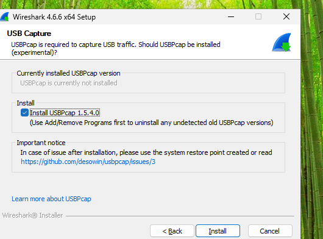
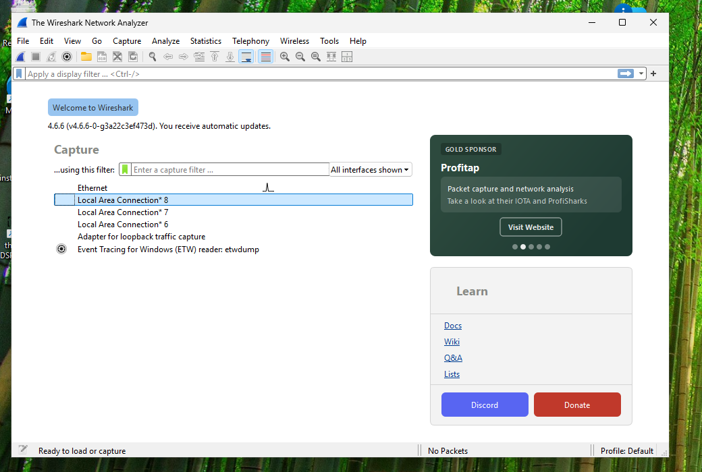
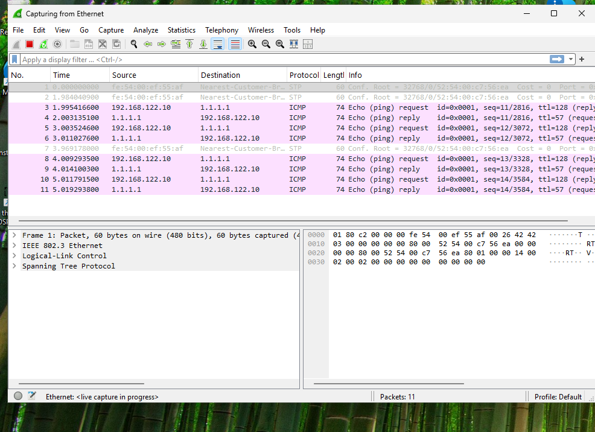

# Capturing a USB session — help add support for your device

openDSP-4x4 learns how to talk to a device by **watching how the official Windows editor talks to
it over USB** — no firmware, no guesswork. So if you own a related unit — for example a **t.racks
DSP206 / DSP408**, or the equivalent **Peavey VSX26e / VSX48e**, which share the 4x4's editor — you
can help add support just by recording a short USB session and sending it over.

No coding required, and it takes about 10 minutes. Here's how. 🙂

> 📷 The capturing screenshot (step 3) is still a placeholder — if you grab a clear one during
> your capture, we'd love it in your issue (see step 5).

## What you'll need
- Your DSP connected by USB to a Windows PC, with the official editor installed and working.
- [Wireshark](https://www.wireshark.org/download.html) (free). The Windows installer bundles
  **USBPcap**, the USB capture driver.

## 1. Install Wireshark + USBPcap
Run the installer and click **Next** through with the defaults (leave **Npcap** ticked when it
offers it). Near the end it shows a **USB Capture** page — tick **Install USBPcap** there; it's
*off* by default, and it's what captures USB traffic. Then finish and **reboot** so the capture
drivers load.

*The installer's USB Capture page — tick "Install USBPcap" (off by default).*

## 2. Pick the right capture interface
Open Wireshark. The start screen lists capture interfaces named **USBPcap1**, **USBPcap2**, … —
one per USB root hub. The one your DSP is on shows a small activity sparkline when you interact
with the unit.

Tip: if you're unsure which it is, unplug other USB devices (especially a USB keyboard/mouse) so
the capture is just the DSP.

*Wireshark's start screen and its interface list. With USBPcap installed and the DSP plugged in,
**USBPcap1/2…** entries appear in this list alongside the network adapters.*

## 3. Record a short session
Double-click the USBPcap interface to start capturing. Then, in the **editor**, do the following
**slowly, one action at a time** — a short pause between each makes them easy to tell apart:

1. Connect to the unit (let it finish loading the current settings).
2. Mute **output 1**, then unmute it.
3. Change an **output gain** by a few dB.
4. Sweep **one PEQ band's frequency** up, then back down.
5. Change a **crossover** frequency on one output.
6. **Recall** a preset.

Then stop the capture (the red square).

*A capture in progress — each editor action shows up as a burst of packets.*

It helps a lot if you jot down the order you did things; Wireshark timestamps every packet, so we
can line each action up with the bytes on the wire.

## 4. Save it
**File → Save As**, choose the **pcapng** format, and save.

## 5. Send it as a GitHub issue
[Open a new issue](https://github.com/GlassOnTin/opendsp-4x4/issues/new) and include:

- **The capture, zipped.** GitHub won't accept a raw `.pcapng` attachment, but it accepts `.zip` —
  zip the file and drag it into the issue.
- **The model** (e.g. "Peavey VSX48e") and its **USB VID/PID**. To find the VID/PID: Device Manager
  → your DSP under *Human Interface Devices* → Properties → Details → *Hardware Ids* — it reads
  `HID\VID_xxxx&PID_xxxx`. (For reference, the 4x4 is VID `0168` / PID `0821`.)
- **The list of actions, in the order** you did them.

From there we can map the protocol, and if it matches the 4x4 family, adding your model is usually
small.

## Is this safe / private?
A capture contains only the USB control messages between the editor and the DSP — gain values, EQ
settings, and the like — not files or anything personal. If other USB devices share the same root
hub, their traffic can be included too, so unplugging other USB gear during the capture keeps it
clean (and smaller).

---

Thanks for helping — community captures are how this project grows to cover more hardware.
